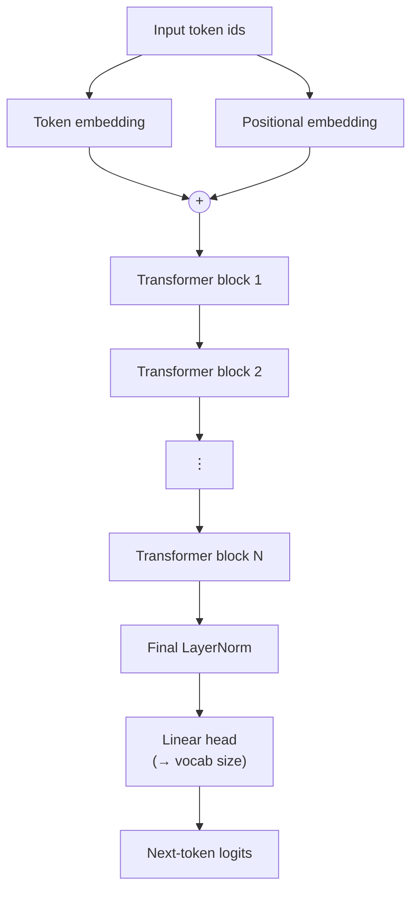
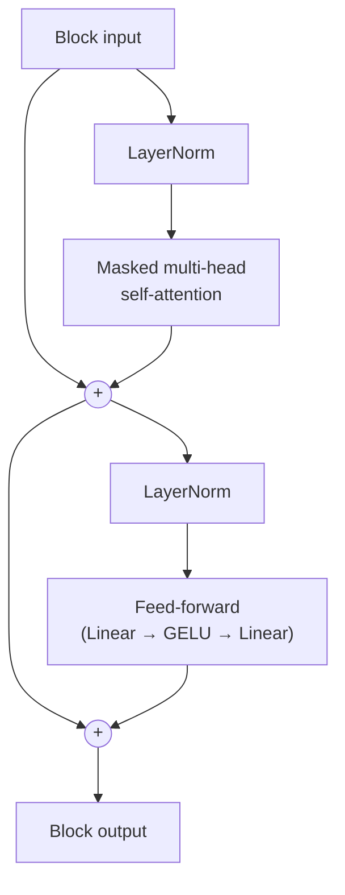

# LLMs From Scratch — GPT-2

Implementing large language models from scratch, notebook by notebook.
GPT-2 is the only model implemented so far.

The goal here isn't a production-ready model — it's building each
piece of a decoder-only transformer by hand, in order, so that
"attention" stops being a black box and becomes code you wrote
yourself and can explain line by line.

## Notebooks

The notebooks build on each other — each one adds the piece of
machinery the next one assumes is already understood.

| Notebook | Builds |
|---|---|
| `Simplified_attn.ipynb` | Attention with no trainable weights — a first pass at *why* attention works (weighting other tokens by similarity) before any learned parameters are involved |
| `selfAttention15.ipynb` | Self-attention with trainable Q/K/V projections, the causal mask that stops a token attending to the future, and splitting that into multiple heads |
| `GPT_ARCH.ipynb` | Assembles the attention block into the full GPT-2 architecture — embeddings, stacked transformer blocks, and the output head |

## Architecture

GPT-2 is a **decoder-only transformer**: a stack of identical blocks,
each combining causal self-attention (so a token can only look at
itself and what came before it) with a small per-token feed-forward
network, trained to predict the next token.



### Inside one transformer block

Each block is two sub-layers, both wrapped in a residual connection
so gradients have a direct path through the whole stack — this is
what makes it practical to stack many of these without training
falling apart.



**Masked multi-head self-attention** is the mechanism `selfAttention15.ipynb`
builds up: every token is projected into a query, key, and value
vector; each token's query is compared against every other token's
key to produce attention scores; a causal mask sets the scores for
any future position to −∞ before the softmax, so a token can never
attend to something that comes after it — this is what makes the
model autoregressive rather than bidirectional. Splitting Q/K/V into
multiple heads before this comparison lets different heads specialize
in different kinds of relationships (e.g. local syntax vs. longer-range
dependencies) instead of averaging everything into one representation.

**The feed-forward sub-layer** is a small two-layer MLP (expand, GELU,
project back down) applied identically and independently to every
token position — it's where the model does per-token computation,
as opposed to attention, which is the only place information moves
*between* positions.

**Token + positional embeddings** are summed before the first block
because self-attention itself has no notion of order — without adding
position information, "the cat sat" and "sat cat the" would look
identical to the attention mechanism.

## Status

GPT-2 is the only architecture implemented so far — no training loop
or checkpoint here yet, just the model built up piece by piece across
the notebooks above.

## Running the notebooks

```bash
pip install torch jupyter
jupyter notebook
```

Open the notebooks in the order listed above — each assumes the
concepts from the previous one.
